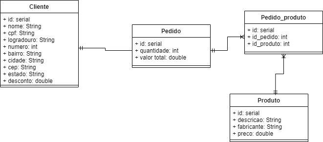

# gerencia_configuracao_trabalho

### Trabalho para a disciplina Gerência de Configuração da UDESC

**Objetivo**  
Este trabalho tem como objetivo principal mostrar ao aluno de maneira prática as bases da
gerência de configuração e seus benefícios.

**Introdução e funcionalidades**  
Imagine uma loja de informática que precisa emitir pedidos de venda com os dados do cliente,
produtos vendidos e seus respectivos valores. O proprietário desta loja tem pressa para ver o
software funcionando e por isso será necessário desenvolver o sistema de maneira iterativa e
incremental, ou seja, serão liberadas pequenas versões com objetivo de envolver os Stakeholder
e agilizar os cadastros iniciais.

*v1*  
•O sistema deve permitir manter e cadastrar produtos (consulta, inclusão, alteração e exclusão
de registros).  
•O cadastro de produtos deve conter os campos: Descrição e fabricante.  

*v2*  
•O sistema deve permitir manter e cadastrar clientes (consulta, inclusão, alteração e exclusão
de registros).  
•O cadastro de clientes deve conter os campos: Nome, CPF, logradouro, número, bairro,
cidade, CEP e estado.  

*v3*  
•O sistema deve permitir manter e cadastrar pedidos (consulta, inclusão, alteração e exclusão
de registros).  
•O cadastro de pedidos deve permitir o relacionamento com um cliente.  
•O cadastro de pedidos deve permitir o relacionamento com um ou mais produtos.  
•O cadastro de pedidos deve permitir inserir quantidade, preço unitário e o desconto em cada
produto.  
•O sistema deve calcular o valor total do pedido.  

*v3.1*  
•O sistema deve permitir cadastrar o preço de venda no cadastro de produtos.  
•O sistema deve permitir cadastrar o desconto padrão no cadastro de clientes.  
•Durante a digitação do pedido, o sistema deve buscar o preço do cadastro do produto.  
•Durante a digitação do pedido, o sistema deve buscar o desconto padrão do cadastro do
cliente.  
  
*Diagrama UML banco de dados (v3.1)*  
